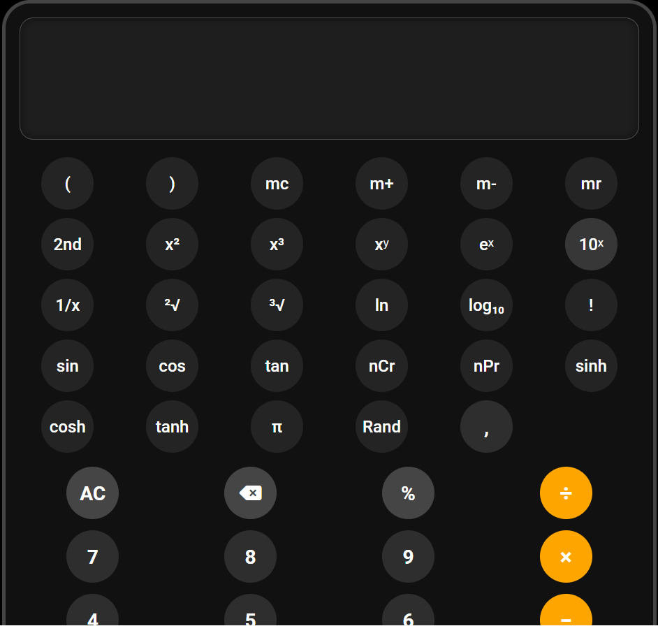
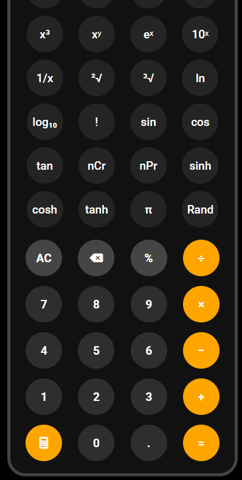
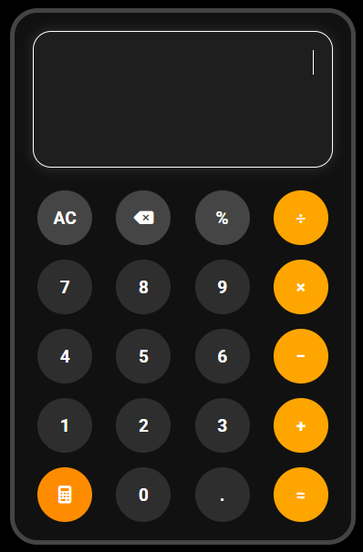

# 🧮 Scientific Calculator

A modern and responsive Scientific Calculator built using **HTML, CSS, and JavaScript** with support for advanced mathematical operations, keyboard input, and mobile responsive scientific mode.

---
---

# 🚀 Live Demo

🔗 https://ritu-scientific-calculator.netlify.app/

---

# 🚀 Features

✅ Basic Operations  
- Addition
- Subtraction
- Multiplication
- Division
- Percentage

✅ Scientific Operations  
- Power (`x²`, `x³`, `xʸ`)
- Square Root
- Cube Root
- `sin`, `cos`, `tan`
- `sinh`, `cosh`, `tanh`
- `log`, `ln`
- `nCr`, `nPr`
- Factorial
- Random Number
- π value
- Exponential Functions

✅ Extra Features  
- Keyboard Support
- Backspace Support
- Responsive Design
- Mobile Scientific Toggle
- Beautiful UI
- Real Calculator Symbols (`× ÷ −`)
- Dynamic Expression Evaluation

---

# 📸 Screenshots

## 💻 Desktop Mode




---

## 📱 Mobile Mode





---

# 🛠️ Tech Stack

- HTML5
- CSS3
- JavaScript (ES6)

---

# 📂 Project Structure

```bash
Scientific-Calculator/
│
├── index.html
├── style.css
├── app.js
│
├── assets/
│   ├── parser.js
│   ├── calculator.js
│   ├── desktop-1.png
│   ├── desktop-2.png
│   ├── mobile-1.png
│   └── mobile-2.png
